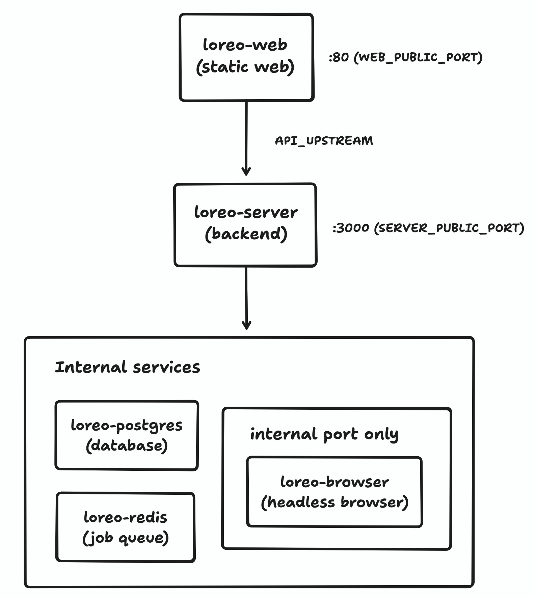

# Self-Hosting Loreo

This guide walks through deploying Loreo with Docker Compose, including domain setup, SSL, and ongoing maintenance.

## Architecture



Loreo's production stack consists of five containers:

| Service          | Image                                | Role                                                        |
| ---------------- | ------------------------------------ | ----------------------------------------------------------- |
| `loreo-postgres` | `postgres:17-alpine`                 | Database                                                    |
| `loreo-redis`    | `redis:7-alpine`                     | Job queue (BullMQ) for extraction, imports, and RSS polling |
| `loreo-browser`  | `ghcr.io/technowizard/loreo-browser` | Headless browser for article extraction                     |
| `loreo-server`   | `ghcr.io/technowizard/loreo-server`  | Hono API, background jobs                                   |
| `loreo-web`      | `ghcr.io/technowizard/loreo-web`     | Nginx + static React app                                    |

The web container serves the React app through nginx and proxies API requests to the server.

The server connects to Postgres, Redis, and the browser service internally. No services other than the web and server containers are exposed on host ports.

## Prerequisites

- A Linux server with Docker and Docker Compose installed
- A domain name pointing to your server
- Git (to clone the repository)

## Quick Start

```bash
# Clone the repository
git clone https://github.com/technowizard/loreo.git
cd loreo

# Create and edit your production environment
cp .env.prod.example .env.prod
nano .env.prod # or use text editor of your choice

# Start the stack
docker compose --env-file .env.prod -f docker-compose.prod.yml up -d
```

Your Loreo instance will be available at `http://YOUR_SERVER_IP:3001` (web) and `http://YOUR_SERVER_IP:3000` (API).

## Environment Configuration

All production configuration lives in `.env.prod`. Copy the example and fill in every value:

```bash
cp .env.prod.example .env.prod
```

### Required Variables

| Variable            | Description                                                                    |
| ------------------- | ------------------------------------------------------------------------------ |
| `POSTGRES_USER`     | Database user (e.g. `loreo`)                                                   |
| `POSTGRES_PASSWORD` | Database password — generate a strong random value at least 16 characters long |
| `POSTGRES_DB`       | Database name (e.g. `loreo`)                                                   |
| `CORS_ORIGINS`      | Your deployment domain (e.g. `https://loreo.example.com`)                      |
| `JWT_SECRET`        | Random string of at least 32 characters                                        |
| `PUBLIC_URL`        | Public URL where Loreo is accessed (e.g. `https://loreo.example.com`)          |

### Port Variables

| Variable             | Default | Description                                                                                                                                             |
| -------------------- | ------- | ------------------------------------------------------------------------------------------------------------------------------------------------------- |
| `SERVER_PUBLIC_PORT` | `3000`  | Host port for the API container. Change if port 3000 is in use. The server always listens on port 3000 internally; this only controls the host mapping. |
| `WEB_PUBLIC_PORT`    | `3001`  | Host port for the web container. Change if port 3001 is in use.                                                                                         |

### Optional RSS Polling Variables

| Variable                     | Default | Description                                                   |
| ---------------------------- | ------- | ------------------------------------------------------------- |
| `FEED_POLL_SCAN_INTERVAL_MS` | `60000` | How often BullMQ scans for subscriptions that are due to poll |
| `FEED_POLL_SCAN_BATCH_SIZE`  | `100`   | Maximum due subscriptions enqueued by each scan               |

BullMQ stores one stable recurring scan scheduler in Redis, so registering it from multiple server replicas does not multiply scheduled scans.

### Generating Secrets

```bash
# Generate a JWT secret
openssl rand -hex 32

# Generate a database password
openssl rand -base64 24
```

### Complete Example

```env
POSTGRES_USER=loreo
POSTGRES_PASSWORD=<generated-password> # minimum 16 characters
POSTGRES_DB=loreo

SERVER_PUBLIC_PORT=3002
WEB_PUBLIC_PORT=3001

CORS_ORIGINS=https://loreo.example.com
JWT_SECRET=<generated-secret>  # minimum 32 characters

PUBLIC_URL=https://loreo.example.com
```

## Service Details

### PostgreSQL

Data is persisted in the `postgres_data` Docker volume. The database runs on an internal network and is not exposed to the host. Backups must be done through `docker exec`.

### Redis

Used by BullMQ for background job processing (article extraction, image downloads, CSV imports, and RSS feed polling/manual refresh). Data is persisted in the `redis_data` volume.

### Browser Service

The browser container runs a Camoufox-compatible Playwright server. It requires shared memory (`shm_size: 1g`) and is isolated on its own Docker network. Port 4444 is not exposed to the host.

### Server

The API server handles authentication, article management, RSS feed subscriptions, and background job scheduling. It automatically runs database migrations on startup via `docker-entrypoint.sh`.

The server uses `STORAGE_PROVIDER: local-docker` by default, storing uploaded files in the `storage_data` volume. See the Storage section for S3 configuration.

### Web

The web container is portable: it does not require rebuilding when your deployment URL or server port changes. The browser calls the API on the same origin (through nginx's reverse proxy), and the nginx template resolves `${API_UPSTREAM}` at container startup.

The default `API_UPSTREAM=http://loreo-server:3000` works for standard Docker Compose deployments. You only need to change it if you rename the server service or run containers on different Docker networks.

## Reverse Proxy

Place Loreo behind a reverse proxy for SSL termination. Here are examples for common proxies.

### Nginx

```nginx
server {
    listen 443 ssl http2;
    server_name loreo.example.com;

    ssl_certificate     /etc/ssl/loreo.example.com.crt;
    ssl_certificate_key /etc/ssl/loreo.example.com.key;

    client_max_body_size 50M;

    location / {
        proxy_pass http://127.0.0.1:3001;
        proxy_set_header Host $host;
        proxy_set_header X-Real-IP $remote_addr;
        proxy_set_header X-Forwarded-For $proxy_add_x_forwarded_for;
        proxy_set_header X-Forwarded-Proto $scheme;
    }
}
```

### Caddy

```
loreo.example.com {
    reverse_proxy localhost:3001
}
```

### Traefik

Add these labels to the `loreo-web` service in `docker-compose.prod.yml`:

```yaml
labels:
  - 'traefik.enable=true'
  - 'traefik.http.routers.loreo.rule=Host(`loreo.example.com`)'
  - 'traefik.http.routers.loreo.tls.certresolver=letsencrypt'
```

### Configuration with Reverse Proxy

When using a reverse proxy:

1. Set `WEB_PUBLIC_PORT` to match the port your proxy forwards to
2. Set `PUBLIC_URL` to your HTTPS domain (e.g. `https://loreo.example.com`)
3. Set `CORS_ORIGINS` to the same HTTPS domain
4. The server port (`SERVER_PUBLIC_PORT`) does not need to be exposed through the proxy — nginx inside the web container handles API routing

## Storage

### Local Storage (Default)

The production compose uses `STORAGE_PROVIDER: local-docker` with data persisted in the `storage_data` volume. This works well for single-server deployments.

Back up the volume:

```bash
docker run --rm -v loreo-prod_storage_data:/data -v $(pwd):/backup alpine \
  tar czf /backup/loreo-storage-backup.tar.gz -C /data .
```

### S3-Compatible Storage

For multi-server or cloud deployments, configure S3-compatible storage. Add these variables to `.env.prod` and pass them as environment variables to the `loreo-server` service:

| Variable               | Description                                         |
| ---------------------- | --------------------------------------------------- |
| `STORAGE_PROVIDER`     | Set to `s3`                                         |
| `S3_ENDPOINT`          | S3 endpoint URL (omit for AWS S3, set for R2/MinIO) |
| `S3_REGION`            | Bucket region (default: `auto`)                     |
| `S3_ACCESS_KEY_ID`     | Access key                                          |
| `S3_SECRET_ACCESS_KEY` | Secret key                                          |
| `S3_BUCKET_NAME`       | Bucket name                                         |
| `S3_PUBLIC_URL`        | Public URL for the bucket (CDN, R2 domain, etc.)    |

Add these to the `loreo-server` environment block in `docker-compose.prod.yml`.

## Database Backups

### Backup

Replace `<POSTGRES_USER>` and `<POSTGRES_DB>` with the values from your `.env.prod`.

```bash
docker exec loreo-prod-loreo-postgres-1 pg_dump -U <POSTGRES_USER> <POSTGRES_DB> > loreo-backup-$(date +%Y%m%d).sql
```

### Restore

```bash
docker exec -i loreo-prod-loreo-postgres-1 psql -U <POSTGRES_USER> <POSTGRES_DB> < loreo-backup-YYYYMMDD.sql
```

### Automated Backups

Add a cron job for daily backups:

```bash
0 2 * * * docker exec loreo-prod-loreo-postgres-1 pg_dump -U <POSTGRES_USER> <POSTGRES_DB> > /backups/loreo-$(date +\%Y\%m\%d).sql
```

## Updating

Loreo uses GitHub Container Registry images tagged `latest` for the main branch.

```bash
# Pull new images
docker compose --env-file .env.prod -f docker-compose.prod.yml pull

# Recreate containers with new images
docker compose --env-file .env.prod -f docker-compose.prod.yml up -d
```

Database migrations run automatically when the server container starts. The server's `docker-entrypoint.sh` applies any pending migrations before starting the API.

Migration `0004_feed_item_pagination_query_shapes` builds two `feed_items` indexes with standard `CREATE INDEX`, which briefly blocks writes to that table while each index is built. Installations with a large existing RSS collection should schedule this update during a low-traffic maintenance window.

### Pinning Versions

For production stability, consider pinning to specific version tags instead of `latest`:

```yaml
# In docker-compose.prod.yml, change:
image: ghcr.io/technowizard/loreo-server:latest
# To:
image: ghcr.io/technowizard/loreo-server:v0.1.0
```

Check available tags at https://github.com/technowizard/loreo/pkgs/container/loreo-server.

## Building From Source

If you prefer building images locally instead of pulling from GHCR:

```bash
docker build -f apps/server/Dockerfile.browser -t ghcr.io/technowizard/loreo-browser:latest .
docker build -f apps/server/Dockerfile.prod -t ghcr.io/technowizard/loreo-server:latest .
docker build -f apps/web/Dockerfile.prod -t ghcr.io/technowizard/loreo-web:latest .
```

The web image build does not require any build arguments — it is portable by default.

## Troubleshooting

### Web app loads but API calls fail

Check that the web container can reach the server:

```bash
docker exec loreo-prod-loreo-web-1 wget -qO- http://loreo-server:3000/health
```

If this fails, verify the `API_UPSTREAM` value on the web container matches the server's internal address and port.

### Server can't reach the database

```bash
docker exec loreo-prod-loreo-server-1 wget -qO- http://loreo-postgres:5432 2>&1 || echo "Postgres unreachable"
```

Verify the database credentials in `.env.prod` match the `loreo-postgres` environment.

### Article extraction fails

The browser service may need more time to start on first run:

```bash
docker logs loreo-prod-loreo-browser-1
```

Look for a line indicating Camoufox is ready. The server will retry failed extraction jobs automatically. Something like:

```
browser-1   | Browser server listening on port 4444
browser-1   | WebSocket endpoint: ws://0.0.0.0:4444/camoufox
```

### Port already in use

If port 3000 or 3001 is in use, set `SERVER_PUBLIC_PORT` and `WEB_PUBLIC_PORT` in `.env.prod` to different values. The internal container ports remain unchanged.

### Viewing logs

```bash
# All services
docker compose --env-file .env.prod -f docker-compose.prod.yml logs -f

# Specific service
docker compose --env-file .env.prod -f docker-compose.prod.yml logs -f loreo-server
```

## Security Notes

- Always set strong, unique values for `JWT_SECRET` and `POSTGRES_PASSWORD`
- Place the stack behind a reverse proxy with SSL
- The browser service is on an isolated Docker network — do not expose port 4444 to the host
- Keep the server and web containers updated for security patches
